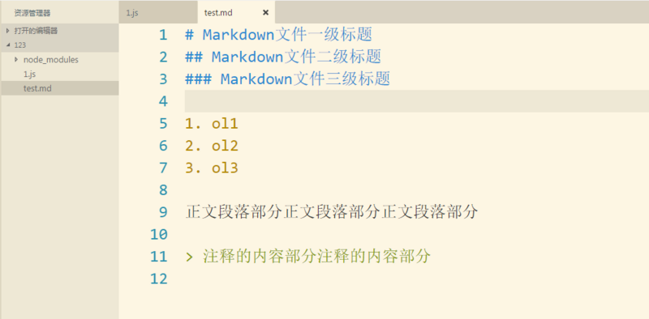
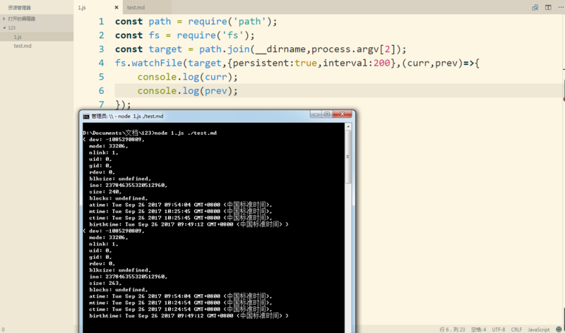
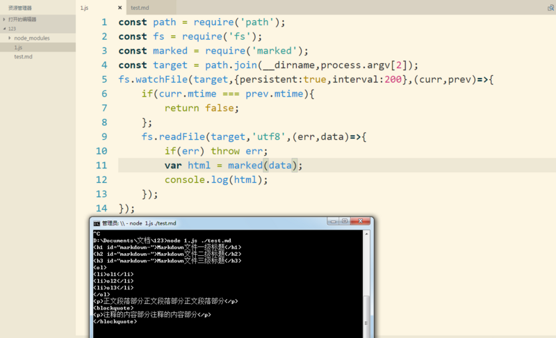

### 基于node实现Markdown文件转换为HTML文件，并支持浏览器端的实时刷新

这个案例的整体功能描述为，利用`node`当中的`fs`模块实时监视指定的`Markdown`文件当中的内容变化，（该`Markdown`文件的路径以相对于当前`js`脚本文件的形式，作为命令行的参数传入），一旦其内容发生了修改，即使用`fs`模块读取该文件的内容，并利用第三方模块`marked`来将其`Markdown`代码转换为对应的`html`代码，之后再利用`github-markdown-css`给其加入样式，再完成骨架拼接，最后将完整的`html`代码写入同目录下的同文件名，后缀名为`.html`的文件当中，写入成功之后，再调用第三方模块包`browser-sync`来实现浏览器端的实时刷新。

示例用法为：先在该项目文件夹下，使用命令`->npm install`来把`package.json`文件当中的依赖包都下载下来。接下去使用命令`->node index.js ./README.md`可以运行主文件并监视同目录下的`README.md`文件，此时`browser-sync`会自动启动浏览器，第一次无法正常显示生成的`README.html`文件，需要我们回到项目文件夹下对`README.md`文件进行一次`ctrl+s`的保存操作，则第一次手动刷新浏览器后就可以正常显示内容，之后我们修改`README.md`文件并`ctrl+s`保存之后，浏览器都能实现实时刷新。
#### 1、实时监视Markdown文件的变化
一开始的文件的结构如下所示

`fs`模块当中用于监视文件变化的方法`fs.watchFile(filename[,options],listener(curr,prev));`其中`filename`参数为被监听的文件的绝对物理路径。可选参数`options`为一个对象，默认为`{persistent:true,interval:5007}`，即代表处于持续监听的状态，并且默认的时间间隔为`5s`左右。可以通过改变`interval`的值来使得间隔时间变短，减少延时。`listener(curr,prev)`为一个回调函数，当被监听的那个文件发生变化，并且在用户进行保存操作（即`ctrl+s`将内存当中编辑的文本写进磁盘）时，触发该回调函数。
使用`process.argv[2]`来获取命令行当中传入的参数。用户在命令行当中输入该`markdown`文件相对于当前`js`脚本文件的相对路径。用法如下所示：

#### 2、读取文件内容并转化为对应的HTML代码
在上述的`listener(curr,prev)`的回调函数当中先对`curr`和`prev`这两个文件状态对象的`mtime`进行比较，从修改时间上进行判断文件在`ctrl+s`保存之后其内容是否真的发生了变化，以此来减少不必要的转化。再确定文件内容真的发生改变之后，再开始读取文件的操作。

    fs.watchFile(target,{persistent:true,interval:200},(curr,prev)=>{
        if(curr.mtime === prev.mtime){
            return false;
        };
        fs.readFile(target,'utf8',(err,data)=>{
            if(err) throw err;
            console.log(data);
        });
    });
在读取了`markdown`文件内容之后，再利用`marked`这个第三方的模块包，将`markdown`中的代码直接转换为对应的`html`代码。
先用命令`->npm install marked` 来下载该模块包，再用`const marked = require('marked');`来引包。`var html = marked(data);console.log(html);`

#### 3、完成html代码的样式添加与骨架拼接

先给转化后的`html`代码加上`markdown`的`css`样式，可以使用当前市面上最被认可的一套`markdown`样式。在`github`上搜索`github-markdown-css`，完成下载之后，将解压文件夹当中的`github-markdown.css`文件放入当前的项目文件夹当中。我们可以在该文件夹的`readme.md`文件当中了解其用法。
官方的提示用法为

    <meta name="viewport" content="width=device-width, initial-scale=1">
    <link rel="stylesheet" href="github-markdown.css">
    
    <article class="markdown-body">
    	<h1>Unicorns</h1>
    	
All the things

    </article>  
即我们需要在我们自己的代码当中复制这两个`style`样式代码，并将`markdown`代码包裹在一个类名为`"markdown-body"`的`div`当中。
接下去进行`html`代码的完整骨架的拼接。

    var template = `
        <!DOCTYPE html>
        <html lang="en">
        <head>
            <meta charset="UTF-8">
            <title></title>
            
        </head>
        <body>
            

                {{{content}}}
            

        </body>
        </html>
    `;
> 这里的字符串拼接使用`ES6`语法当中的模板字符串，之后用读文件的方式把`github-markdown-css`当中的内容读取出来之后，用`replace`方法将其替换`template`字符串当中的`{{{style}}}`部分，而`{{{content}}}`部分用`markdown`文件内容来替换。

完成内容拼接之后，将完整的`html`代码写入同目录下的同文件名，后缀名为`.html`的文件当中。
#### 4、使用browser-sync来实现浏览器端的自动刷新
##### 4.1 通过命令`->npm install brower-sync`来下载这个第三方模块包。
##### 4.2 再用`const browserSync = require('browser-sync');`来引包。
##### 4.3 通过`browserSync`来启动创建一个文件服务器。

    browserSync({
        browser: 'C:\\Program Files\\Google\\Chrome\\Application\\chrome.exe',
        server:path.dirname(target),
        index:path.basename(filename),
        notify:false
    });
`browser`属性值为我们希望使用的浏览器，打开我们的文件，写入该浏览器应用程序在本机上的绝对物理路径。`server`属性值为该文件服务器的根目录，`index`属性值为访问该静态服务器时，打开的默认的索引文件。`notify:false`这个参数的设置可以关闭每次完成浏览器端的刷新时弹出的提示信息。
##### 4.4 使用`browserSync.reload(文件名)`完成浏览器端的自动刷新
在写入操作完成的回调函数当中，使用该语句，完成浏览器端的自动刷新。

    fs.writeFile(filename,allHtml,'utf8',(err)=>{
        if(err) throw err;
        console.log('写入成功！');
        browserSync.reload(path.basename(filename));
    });
这样就完成了Markdown文件转换为HTML文件，并支持浏览器端的实时刷新。
